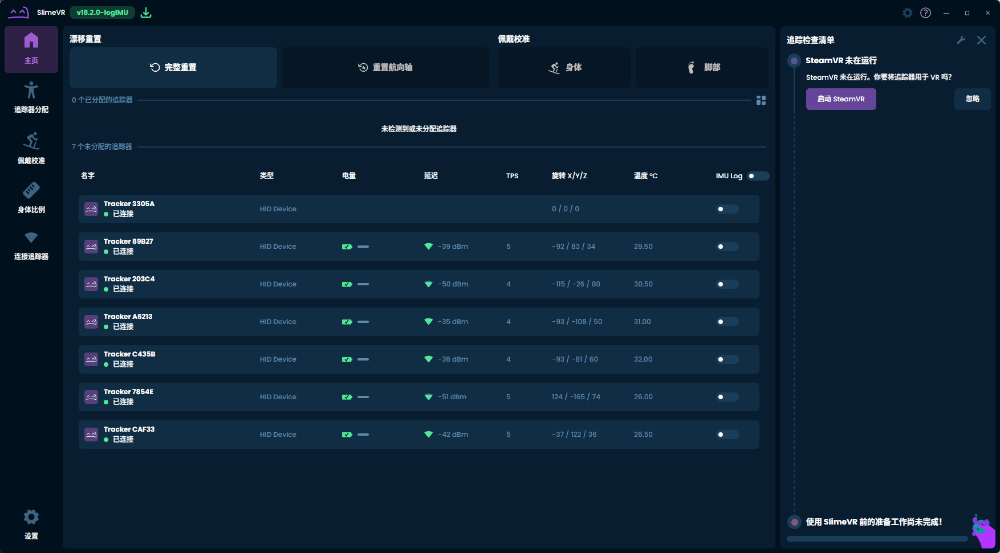
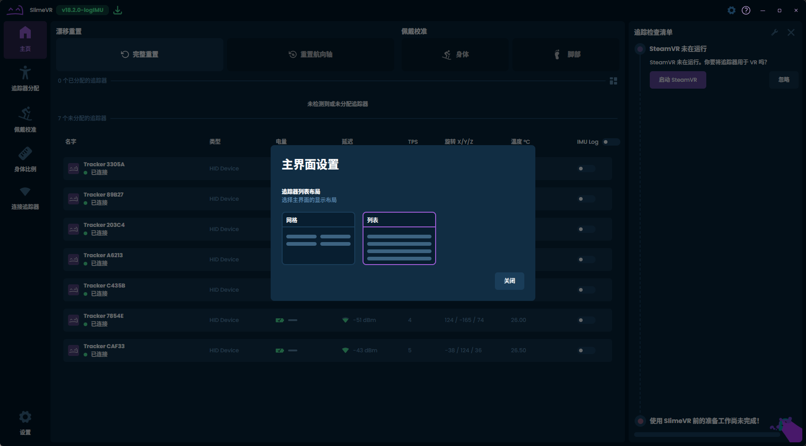
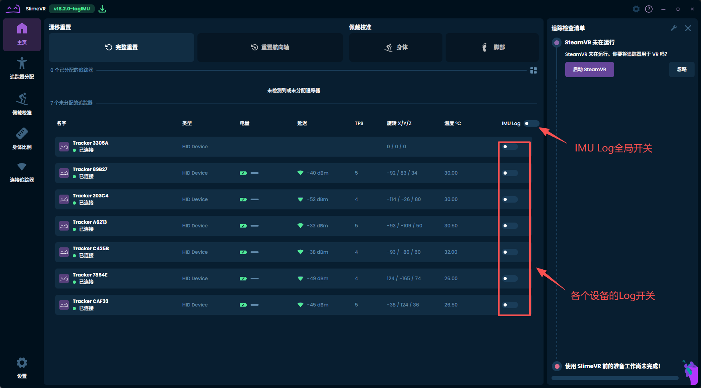
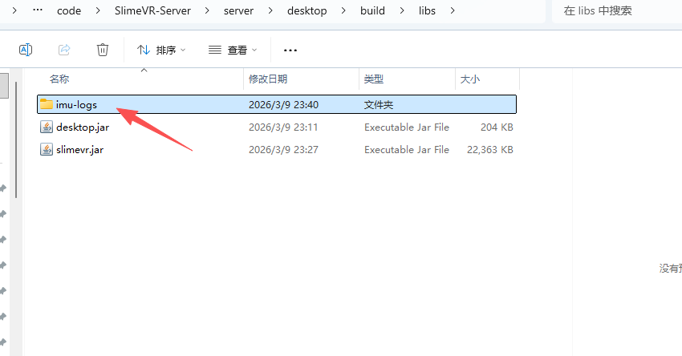
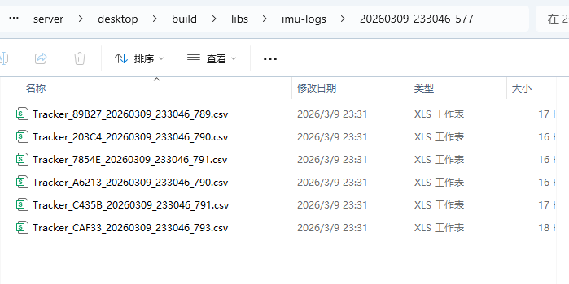
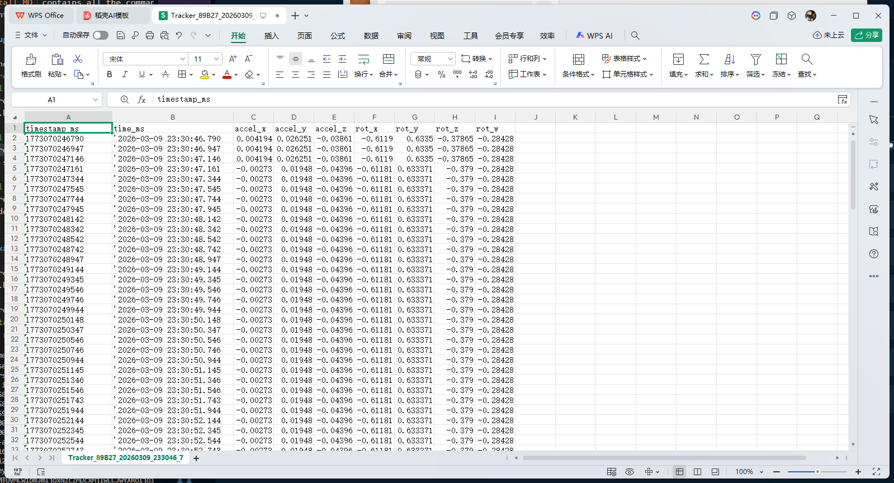

SlimeVR Server增加IMU日志功能
================================

SlimeVR 追踪器内置了日志系统，可以记录 IMU 数据用于调试和分析。

日志文件通常包含时间戳、加速度计数据、陀螺仪数据等 IMU 相关信息，可以帮助开发者或用户分析追踪器的性能和行为。

程序下载
-----------------

源码路径

- https://github.com/bitdeckai/SlimeVR-Server/tree/dev_logIMU

可下载Windows安装包文件如下：

- :download:`slimevr_18.2.0_logIMU_x64-setup.exe <../_static/tools/slimevr_18.2.0_logIMU_x64-setup.exe>`
- :download:`slimevr_18.2.0_logIMU_x64_en-US.msi <../_static/tools/slimevr_18.2.0_logIMU_x64_en-US.msi>`

也可以替换slimevr.jar文件

- :download:`slimevr.jar <../_static/tools/slimevr.jar>`

安装完成后，按照下方步骤打开日志功能并导出日志文件。

打开 log 的步骤
-----------------

按照下方图片 1-5 操作即可完成 log 打开与导出。

1. 打开 SlimeVR Server，进入追踪器相关设置页面（如图 1）。

2. 在设置中找到 IMU Log 或日志相关选项，进入日志功能页面（如图 2）。

3. 点击开始记录（Start/Record）并让追踪器按需要运行，采集需要的 IMU 数据（如图 3）。

4. 采集完成后点击停止记录（Stop），确认日志文件已生成（如图 4）。

5. 点击导出或打开日志文件目录，保存 log 文件用于问题排查或数据分析（如图 5）。

.. toctree::
   :maxdepth: 6
   :caption: SlimeVR

