快速开始
=============

本教程将会快速指导您安装 SlimeVR 相关应用程序，在此之前，请先前往 Steam，完成 SteamVR 的安装

软件安装
---------

您可以使用 `Web Installer <https://github.com/SlimeVR/SlimeVR-Installer/releases/download/v0.2.0/slimevr_web_installer.exe>`_ 安装最新的 SlimeVR 客户端 和 驱动程序，如 Web Installer 安装时，进度条长时间没有更新 或 安装失败 ，则可能是网络问题， 则可以进行手动安装。
保持安装选项框默认即可，一般情况下不需要特别修改。

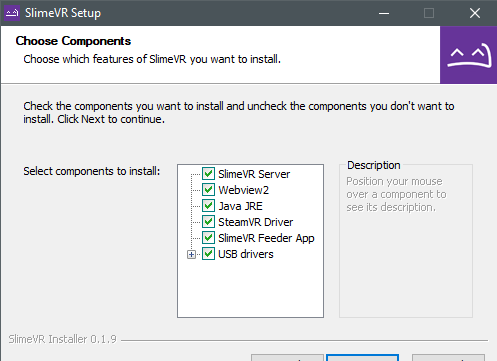

连接和准备你的追踪器
--------------------

请注意，SlimeVR追踪器只能连接到2.4GHz频段的WiFi网络，你的主机（电脑或手机）也必须连接到同一个网络。
1. 打开SlimeVR服务器。在第一页，你可以通过右下角的按钮更改应用语言。准备好后，点击“让我们开始设置！”

2.输入你的2.4GHz Wi-Fi凭证，这样追踪器就能连接Wi-Fi，然后点击提交。

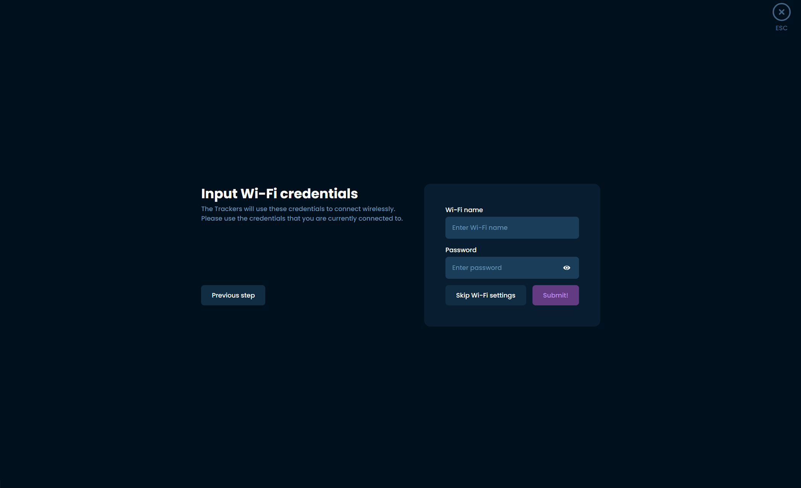

3.一次只插入追踪器并打开它们，你应该会在左侧更新中看到进度条，显示Wi-Fi详情正在发送。一定要用追踪器附带的线缆，因为其他线可能不适合传输数据。

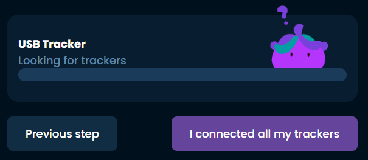

4.当你连接好所有追踪器后，你应该会看到它们在右侧以数字列出。如果你忘了哪些追踪器还没插上，摇晃连接的追踪器会在列表中高亮显示。点击，我连接了所有追踪器，完成后。

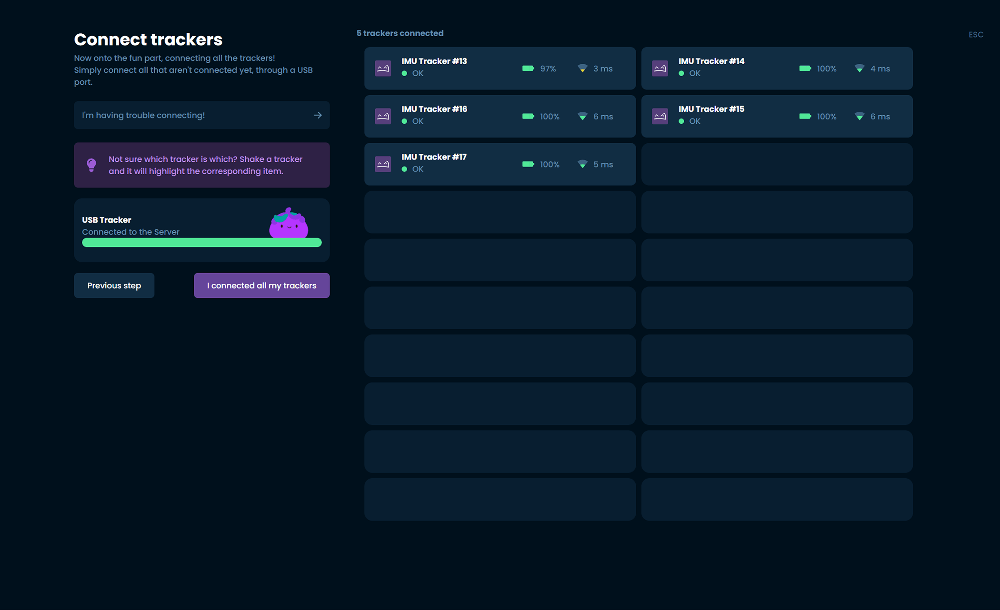

5.按照页面上的指示，开机时把追踪器放在平面上，点击一下。我把追踪器放在桌子上，等待过程完成。

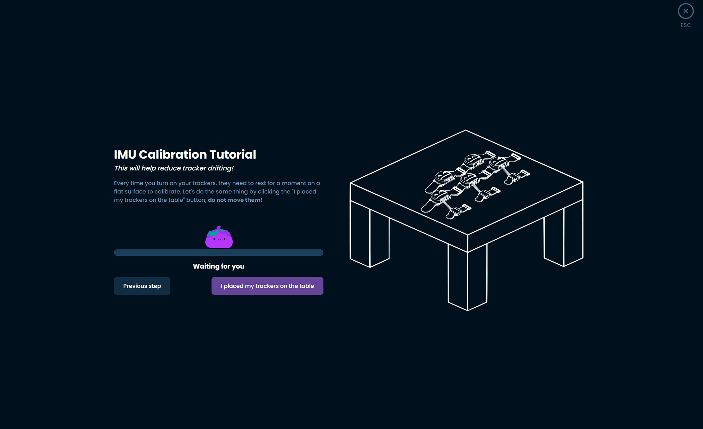

6.校准完成后，点击“继续”。

7.按照页面上的说明，通过绑带和贴纸来准备你的追踪器，帮助你记住每个身体部位的追踪器。当所有追踪器准备好后，点击“我贴上贴纸和绑带！”继续前进。

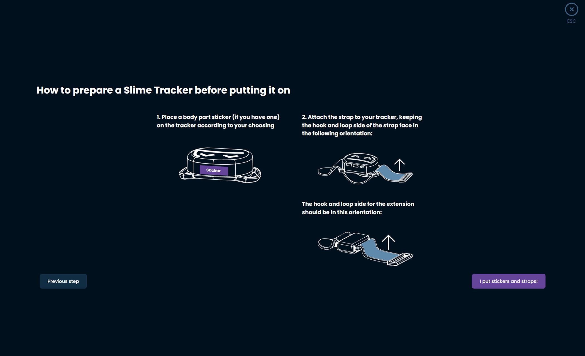

选择和分配身体位置
------------------
1.弄清楚你需要分配哪些身体部位。根据你有多少追踪器，以下是推荐的位置：

      下半身套装（5个追踪器）- 胸部、双腿、双脚踝。
      核心套装（5个追踪器，含一个延长器）——胸部和臀部/腰部（通过带延长器的追踪器）、双大腿、双脚踝。
      增强核心套装（5个追踪器，带三个延伸）——胸部和臀部/腰部（通过带延伸的追踪器）、双大腿、双脚踝和脚（通过带延伸器的追踪器）。
      全身套装（7套追踪器，带三个延伸装置）——双上臂、胸部和臀部/腰部（通过带延伸的追踪器）、双大腿、双脚踝和脚（通过带延伸的追踪器）。

2.使用此列表，选择SlimeVR吉祥物Nighty上与你想选择追踪器区域对应的位置。

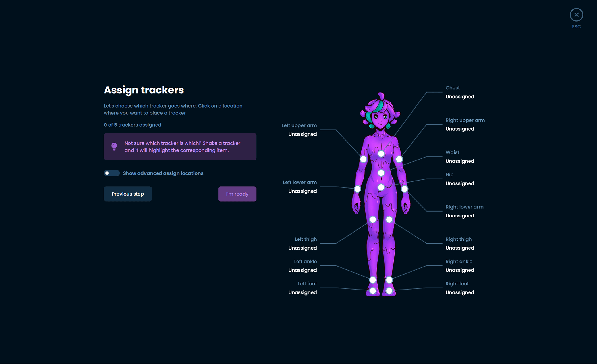

3.弹窗打开时，你可以点击想用的追踪器来指定该位置两次，自动分配。如果你觉得更简单，也可以在列表中选择你想分配的特定追踪器。

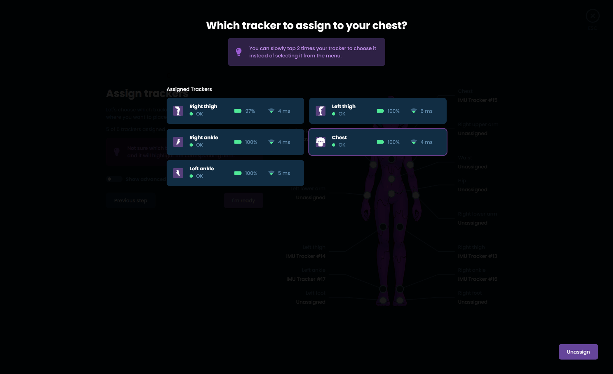

4.分配好所有追踪器后，点击“我准备好继续前进”。
5.花点时间佩戴所有追踪器。你可以在标记的位置佩戴它们，佩戴在身体的前后或任一侧，注意以下建议：
      肌肉发达的部位容易变形，会影响赛道，尽量找一个能减少这种变化的姿势。
      睡衣的示意图应该能大致说明穿戴位置，但你可以围绕身体旋转佩戴位置。例如，胸部追踪器根据服装和体型不同，正面或背面可能更舒适。
      确保你的追踪器与你正向一致，必须面向前方、后方、左侧或右侧。
      确保追踪器朝上，史莱姆的脸应直立，追踪器的平面朝向地面。
      开启追踪器后，试着移动，看看它们在移动时是否静止。有些部位（比如脚踝）在脚踝侧面比前面更合适。
      每个人的身体都不一样！为别人安排合适的取向可能不适合你，你可能需要尝试找到最适合自己的位置。
 一旦你装好追踪器，按下“我准备进入下一步”。

6.SlimeVR提供自动和手动的安装方向判定流程，自动校准能提升追踪质量，但校准不当会让追踪质量变差。这需要一些时间来确定并确认是否适合你以及你佩戴追踪器的方式。我们正在努力改进，但建议新用户使用手动流程。
 
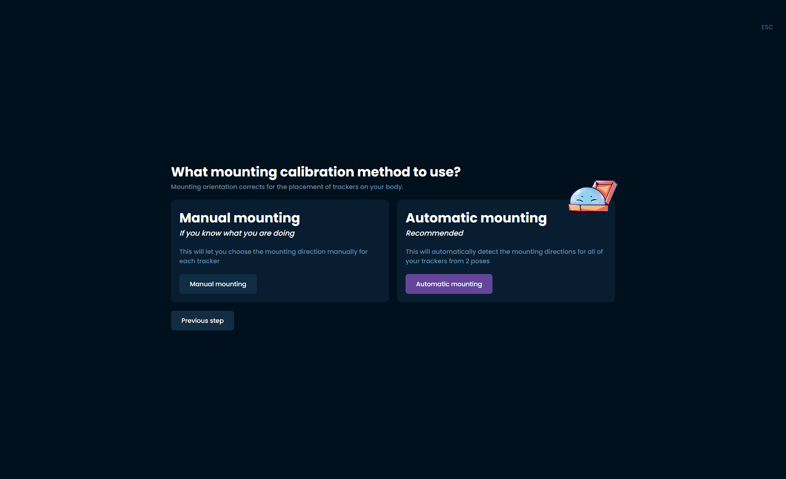
7.点击你的追踪器，可以调出安装方向列表。

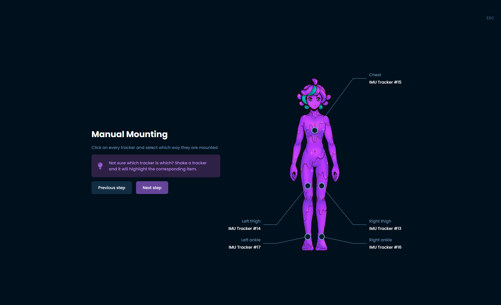

8.选择最能代表该跟踪器安装方向的方向。

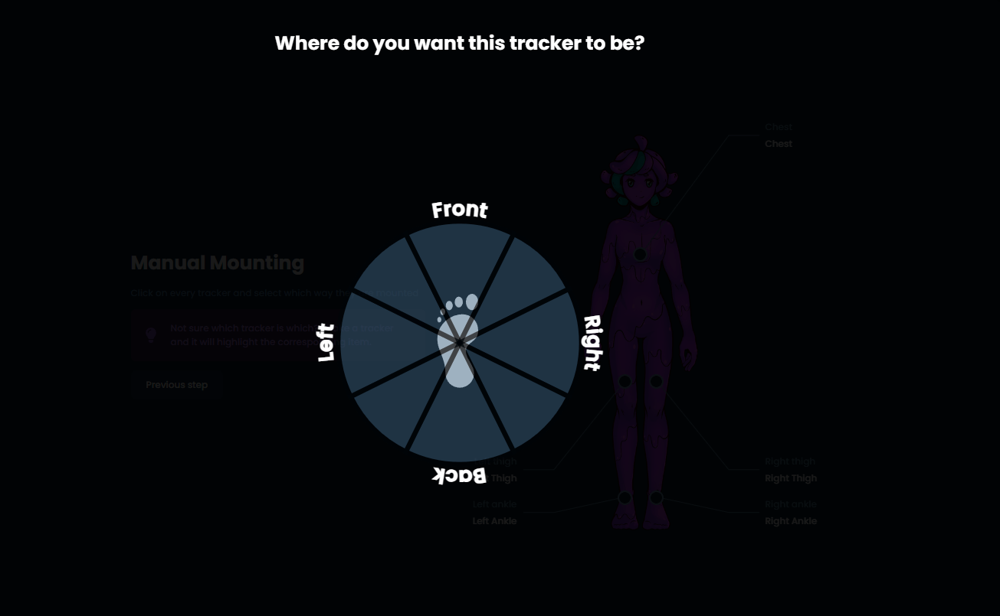

9.对每个追踪器重复此作，完成后点击下一步。

自动设置安装
-------------
SlimeVR提供自动化流程，记录你用追踪器设置的安装方向，这对新用户来说可能会有问题，但对有经验的用户来说效果更好。从这里开始，务必启动SteamVR并戴上头显。如果你只用追踪器做VMC或OSC，请按照前面步骤手动设置安装方向。
在自动化过程中，按照指示作，SlimeVR会推断出追踪器在你身上的位置。

    注意：如果你没有开头显且没有运行SteamVR，自动挂载可能无法正常工作。自动安装可以提升追踪质量，但校准不当会让效果更差。只有在你对SlimeVR有经验时才选择这个选项。

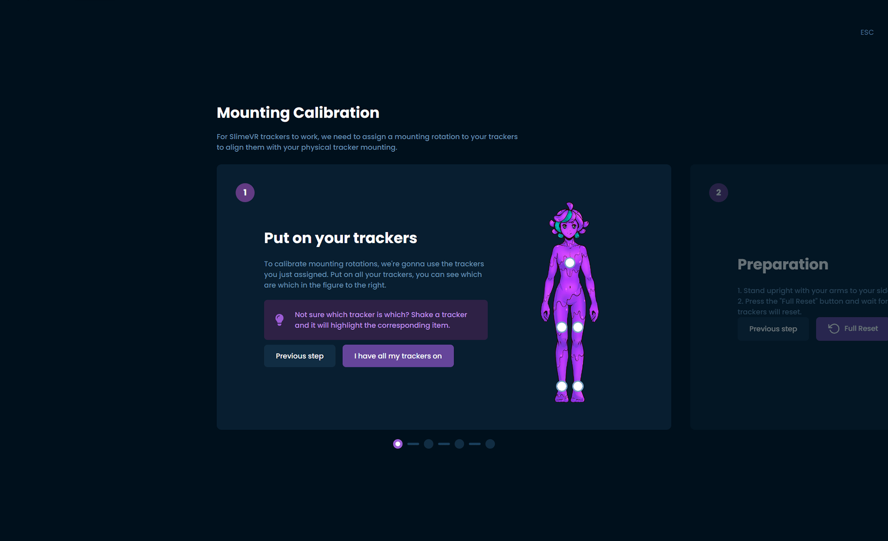

重置教程
---------
1.跟随流程了解追踪器内置的三种不同类型的重置：

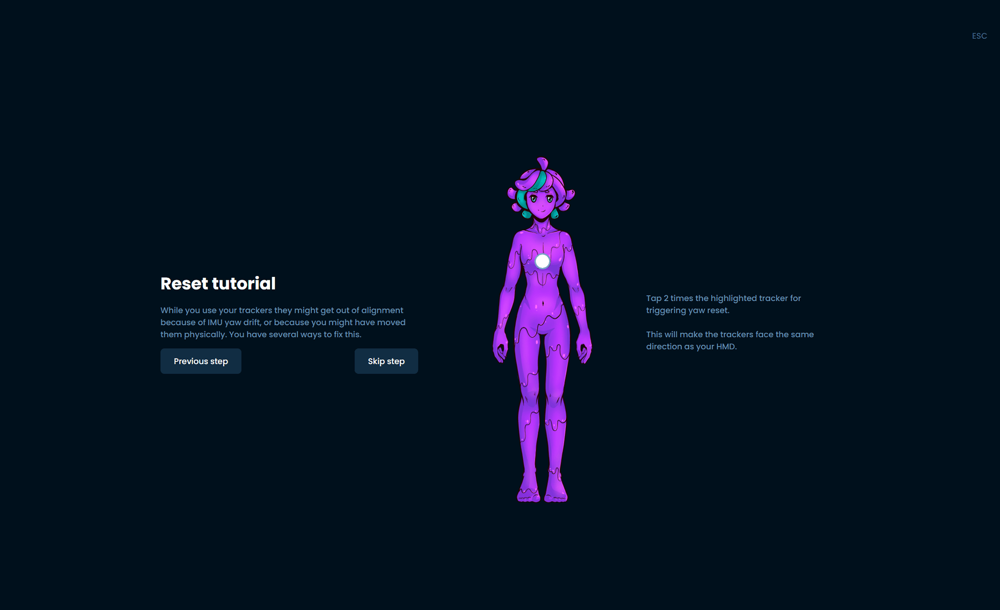
      轻拍胸部——偏航重置，重置追踪器，使其假设面向既定的安装方向。
      轻敲左大腿——完全重置，追踪器会重置为假设你处于I字姿态。
      轻敲右大腿 - 安装重置，追踪器重置到估计的安装方向。你必须处于安装校准向导中所示的滑雪姿势，这样才能正常工作。

2.要完成此过程，请按照所示步骤作并点击指示的追踪器。

比例配置
---------
1.最后一个配置是让SlimeVR来计算你的比例！这是复制你在虚拟空间中动作的重要一步。

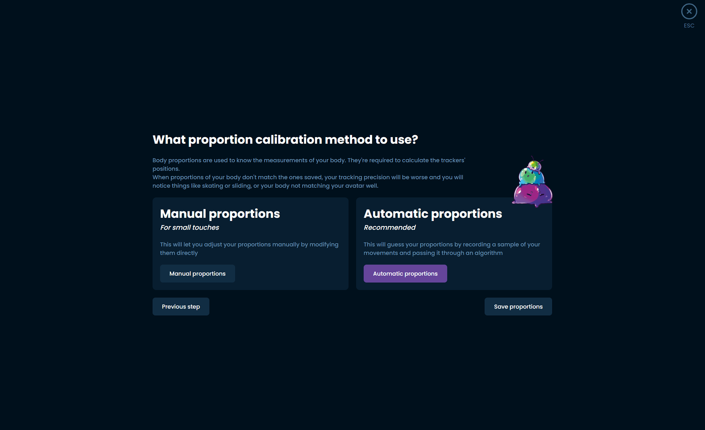

如果你用 SlimeVR 配合 SteamVR，可以自动化这个过程。确保你佩戴了追踪器和头显，并且SteamVR正在运行。在尝试之前，确保头显的地板设置得当非常重要。
如果你没有在SteamVR中使用SlimeVR，就需要手动设置比例。

2.按照提示作，SlimeVR会自动测量你的比例。

      注意：如果你没有戴着头显且没有运行SteamVR，自动比例是无法工作的。在此过程中，完全不要抬脚或移动脚。

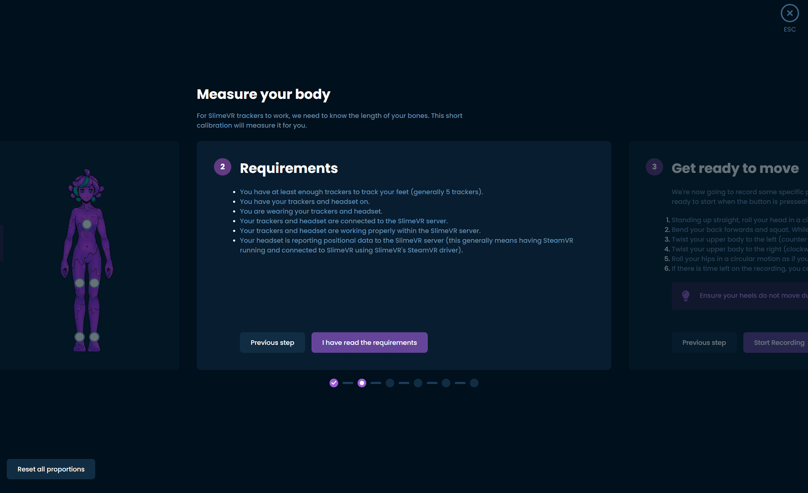

手工艺比例
-----------

如果你不使用 SteamVR，就必须手动设置这些值，或者使用 VRChat OSC 查询来启用自动比例。有关如何测量每个数值的更多信息，请参阅身体比例配置页面顶部的信息。

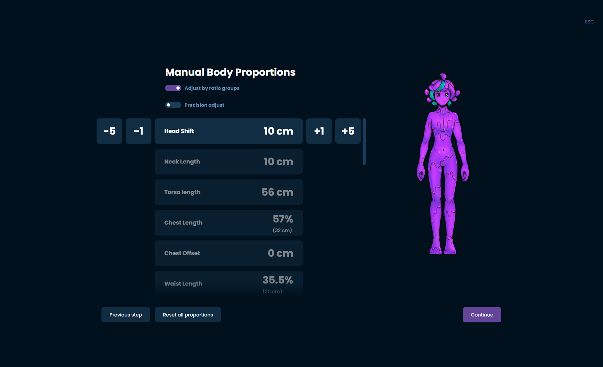

最终设定
----------
最后一步是进入设置页面，具体设置如何使用它。

生成追踪器
----------
SlimeVR 服务器现在自动分配了 SteamVR 追踪器，开启该开关后，会显示每个组会激活哪些追踪器：
• 下半身套装（5个追踪器）——胸部、腰部、膝盖和脚部。
• 核心套装（5个追踪器，含一个延长部分）——胸部、腰部、膝盖和脚部。
• 增强核心套装（5个追踪器，含三个扩展）——胸部、腰部、膝盖和脚部。
• 全身套装（7套追踪器，含三条延伸）——胸部、腰部、膝盖、脚和肘部。

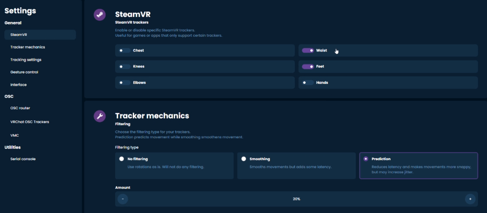

启用SteamVR上的追踪器
----------------------
1. 确保你安装了SlimeVR和安装程序一起，才能用正确的SteamVR驱动。
2. 确保 SteamVR 设置中启用了 SlimeVR 插件>启动/关机>管理插件。
3. 确保你在SlimeVR设置中启用了SteamVR追踪器。

OSC
-----
如果你决定在Steam版本的VRChat上使用OSC追踪器，务必先禁用所有SteamVR追踪器，再进入OSC设置。

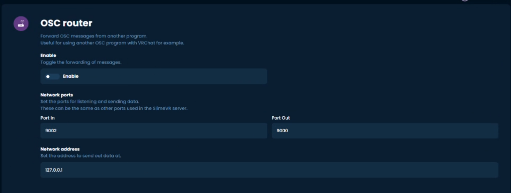

接下来你需要确保网络地址设置正确。这取决于你在哪台设备上运行VRChat或其他兼容OSC的程序。如果你在同一台设备上使用这些功能，默认设置应该没问题，但如果你用的是另一台设备（比如把追踪器连接到独立的Quest），你需要找到该设备的IP地址。127.0.0.1

然后，你可以通过以下建议切换你需要的位置：

下半身套装（5个追踪器）——腰部、膝盖和脚部。
核心套装（5个追踪器，1个延长部分）- 胸部、腰部、膝盖和脚部。
增强核心套装（5个追踪器，3个延长件）——胸部、腰部、膝盖和脚部。
全身套装（7套追踪器，3个延长件）——胸部、腰部、膝盖、脚和肘部。
如果你想切换到SteamVR追踪器，必须先禁用OSC并重新开启SteamVR追踪器。

欲了解更多OSC信息，请访问OSC页面。

恭喜，你的史莱姆追踪器现在应该已经安装好了！

   
在完成这个设置后重新装上它们
下次你想使用追踪器时，只需安装它们，快速通过安装校准向导即可。其他设置都应该保存在你初始设置时！在进行这个过程之前，确保你戴上了头显并运行了SteamVR。

遇到问题了吗？
我在SteamVR里的追踪器设置不正确
如果在SteamVR启动任何游戏前已经设置了这个功能，请进入设置>控制器>管理Vive追踪器，手动设置追踪器的位置以匹配虚拟追踪器的名称。如果这是游戏内的问题，可能是校准问题！
我的追踪器无法连接我的Wi-Fi。

.. toctree::
   :maxdepth: 6
   :caption: SlimeVR

